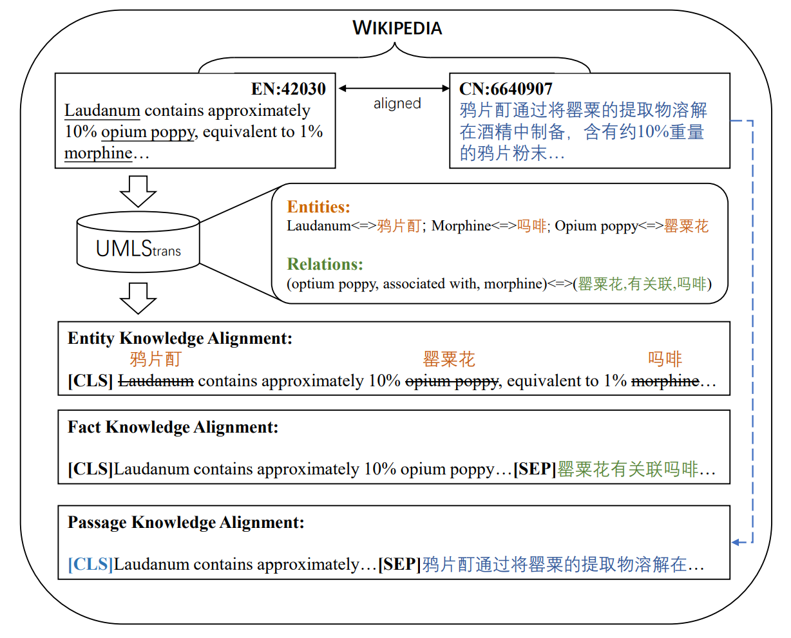

# KBioXLM
## 1.Introduction

Multilingual Biomedical PLM-KBioXLM



## 2.KBioXLM model weights

```python
from transformers import RobertaModel
model=RobertaModel.from_pretrained('ngwlh/KBioXLM')
```

## 3.Installation Tutorial

1. Torch
2. Transformers
3. Deepspeed
4. Tensorboard

## 4.Instructions for use

1. Firstly, in pre-training: ① XLMR+Pre training: Process first_ Data, pre train after obtaining data; ② KBioXLM follows the same steps as XLMR+Pretraining
2. After obtaining the KBioXLM model, call the model in downstream to verify its effectiveness
